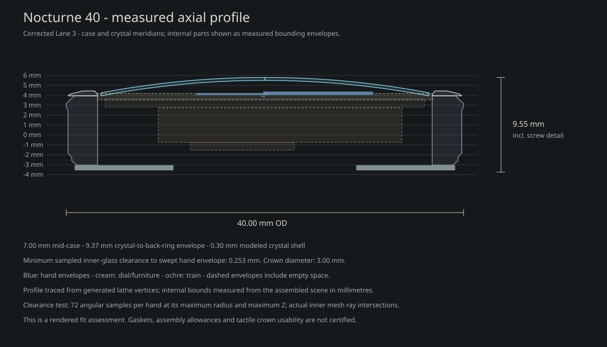

# Nocturne 40 — synthesis pass

The working base remains Lane 3. No historical design URL or default viewer design has been promoted or replaced.

Follow-up: [controlled relighting validation](RELIGHT_VALIDATION.md) originally recorded B as a working base; [the subsequent execution review](EXECUTION.md) supersedes that decision with **B as a provisional temperature preference**. Its warmth is smaller in effect than the initial assessment implied; C's containment survives relighting but is not automatically merged into B.

Open `/compare.html` for the new character comparison. Its study selector also exposes historical, archaeology, execution, and combined groups. Camera, light, hand pose, and the reflection sweep are shared. Each watch can still be opened independently.

## What the experiments say

| Question | Assessment | Evidence |
| --- | --- | --- |
| Preserve Lane 1's warmth? | **Keep as language.** Corrected Lane 1 remains distinctly warmer. B moves only 25% toward its opponent chroma, retaining Lane 3's OKLab lightness before texture quantization. It is deliberately a small shift. | Archaeology front/oblique; character A/B under warm and neutral light. |
| Preserve its inward face? | **Keep the relationship; reject the rendering defect.** Lane 1 changes appreciably when its bezel faces outward and its overlapping top overlay is removed. C recovers some enclosure with a quieter bezel and darker rehaut, using precisely A's geometry. | Archaeology and character front/oblique comparisons. |
| Import Lane 2 lugs? | **Merge the root treatment, retain Lane 3's footprint.** Both donors used one generator. The new root is registered to the actual cylindrical wall and starts tangent to it; its narrower stem and tip remain Lane 3-derived. | Execution lug and side comparisons; historical Lane 2 remains available. |
| Preserve exposed bars and narrowed strap ends? | **Reject as a donor requirement.** They do not account for the warmth or containment that survives the optics correction. The new full-width folded attachment reads more convincingly. | Archaeology versus execution attachment views. |
| Thin the case? | **Unresolved as a future proportion choice; no evidence requiring it now.** The modeled envelope is 9.37 mm to the back ring, about 9.55 mm including screw detail, with a 7 mm mid-case. Corrected reflections and a more substantial strap change the profile read without reducing height. | Execution side comparison and the measured profile below. |

My recommendation is to carry B's modest warmth forward for discussion and keep C's containment available alongside it. The combined version is included as a hypothesis, not a final selection. A retains the brightest inner boundary; C trades some of that brightness for a more enclosed face. I would not widen the bezel or shrink the aperture on this evidence, so the conditional 0.20 mm shoulder experiment was not activated.

## Execution changes and diagnosis

- **Case reflections:** corrected studies use 512 angular samples and small 0.045 mm edge breaks, retaining authored flats and the 40 mm diameter. The remaining staircase pattern proved to be an anisotropic tangent problem: the normal diagnostic was continuous, while removing anisotropy removed the broken highlight. Explicit azimuth tangents fix it without making all the metal rougher. The thin lower seam also uses a revolved surface with a 0.018 mm edge break.
- **Bezel:** the cleaned Lane 1 reverses its inward-facing profile. Corrected studies remove the intersecting separate top annulus, leaving one shoulder surface. This removes the overlay's approximately 0.04 mm height above the underlying bezel; mid-case height and crystal apex remain fixed. Historical lanes retain their old geometry and material behavior.
- **Crystal:** a closed 0.30 mm shell retains the outer 1.55 mm dome. A 1024-pixel cube capture of feathered studio cards supplies coherent surface reflections. Full-opacity transmission replaces the old opacity/transmission mixture. On this material, the cards replace the legacy punctual specular contribution. A shader adjustment prevents the renderer's minimum reflection roughness from unnecessarily blurring the transmitted dial. IOR 1.5 remains a visual approximation, not a claim of a validated sapphire optical model.
- **Leather:** a continuous padded section replaces the separate ribbon and terminal. Center thickness tapers from 2.2 to 1.6 mm; the edges are 1.24 mm. The nose folds around a real 0.58 mm bore, and the underside has a separate lining material. The revised curve carries that section through its bend. The 18-to-16 mm taper and dark brown family remain.
- **Hardware:** the keeper is centered on the revised path and has positive section clearance. The buckle has a 16.6 mm clear opening, a transverse pin, and a matching bore through the leather tail. The existing lug spring-bar axis is unchanged.
- **Lugs:** the physical studies use a sampled cubic root transition registered to the 19.82 mm-radius case wall, easing into Lane 3's narrower section. Mirroring X previously reversed the left horn's winding without reversing its triangles; that defect is corrected in the physical study. The case and lug remain separate visualization meshes meeting at a registered boundary, not a manufacturing-ready Boolean solid.
- **Crown:** the diameter is now 3.0 mm. Its axis and axial projection are retained. Extending the stem from 0.62 to 0.90 mm closes an inherited 0.11 mm gap to the body. Grip detail is more readable; actual finger purchase and winding feel remain physical-prototype questions.

## Measurements and validation

The profile uses generated case/crystal meridians and measured assembled component bounds. The internal rectangles are envelopes, not assertions that each component fills that space.

- A/B/C/combined case, dial, and hand geometry signatures match. Only intended materials and palette differ.
- Actual inner-crystal triangle intersections, sampled at 72 angles per hand using each hand's maximum radius and height, give a conservative minimum gap of **0.2534 mm**. This includes the new inner surface; the old outer-dome-only estimate was not reused.
- Minimum minute swept-radius separation from markers remains **0.2931 mm**. The crown measures **3.0000 mm**, and the case remains **40.0000 mm** across.
- Both lug-attachment bores pass the ray-through-hole check. All sampled geometry is finite; named train pivots, millimetre scale, and product orientation remain intact.
- Core check, TypeScript, production build, shared view/light/pose controls, study switching, reflection sweep, message validation, mobile horizontal comparison access, and default/invalid URL behavior were checked.

Local evidence lives in `.review/synthesis/`: `index.html`, matched screenshots, `geometry.json`, `ui-validation.json`, and the diagnostic current/no-grain/normal images. These review files are intentionally outside version control. The production build retains the existing large viewer-bundle advisory.

The vendor GLB SHA-256 remains `E8C950E5D89DF308AA30FE978254320952DEA10F8BF2BEC72F22F65E88437B6B`. No vendor files, train geometry, arbors, plates, or mechanism architecture were changed. No new dial furniture was introduced.
